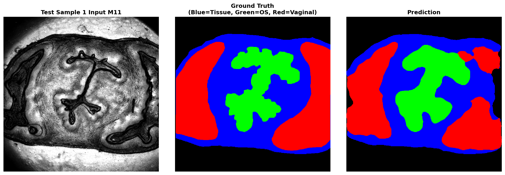

# mmTissueFilter - M11 Tissue Segmentation



mmTissueFilter is a tissue-mask annotation, training, evaluation, and inference
project for Mueller Matrix microscopy images. It supports manual mask creation,
deep-learning segmentation of background, tissue, OS, and vaginal regions,
trained-model inference from Python or MATLAB, and reproducible model
comparisons on a fixed train/validation/test split. The included artifacts
provide trained checkpoints, split metadata, test-set visualizations, and demo
outputs for applying the model to representative M11 images.

The current segmentation workflow uses Mueller Matrix image composites and
ground-truth masks to train multiclass models for:

- Background
- Tissue
- OS
- Vaginal

The repository includes:

- `annotator_gui/`: PyQt annotation tool for creating or editing tissue masks.
- `notebooks/m11_unet/`: original U-Net training and test-analysis notebooks.
- `notebooks/model_comparison/`: model-comparison training, test analysis, and
  inference-speed benchmarking.
- `models/`: trained split metadata, training histories, selected visualizations,
  and model checkpoints.
- `results/model_comparison/`: CSV, figure, PDF, and per-sample outputs from the
  model-comparison analysis.
- `run_trained/`: Python and MATLAB demo wrappers for applying a trained model.

See [CHANGELOG.md](CHANGELOG.md) for a record of dataset/model revisions,
including sample exclusions and split changes affecting reproducibility.

## Citation

If you use this repository or the associated tissue segmentation model, please
cite:

```bibtex
@article{chae2026intensity,
  title={Intensity-based Segmentation of Tissue Images Using a U-Net with a Pretrained ResNet-34 Encoder: Application to Mueller Microscopy},
  author={Chae, Sooyong and Giammattei, Dani and Ajmal, Ajmal and Pei, Junzhu and Sanchez, Amanda and Boonya-ananta, Tananant and Rodriguez, Andres and Novikova, Tatiana and Ramella-Roman, Jessica},
  journal={arXiv preprint arXiv:2602.09787},
  year={2026}
}
```

## Prerequisites

Ensure you have Python installed (tested with Python 3.8+). You can install the required dependencies using:

```bash
pip install -r requirements.txt
```

Common dependencies include:
- `numpy`
- `torch`, `torchvision` (for model training/inference)
- `PyQt5` (for the annotation GUI)
- `matplotlib`, `Pillow` (for visualization)
- `jupyter` (to run notebooks)
- `segmentation-models-pytorch` (for U-Net++, DeepLabV3+, and comparison
  models)

---

## 1. Initial GUI Annotation

The **Tissue Annotation Tool** allows users to manually annotate tissue regions on images to create ground truth masks for training.

**How to run:**
Navigate to the root directory and run:

```bash
python annotator_gui/main.py
```

**Usage:**
1.  Launch the application.
2.  Open a Mueller Matrix image (or composite).
3.  Use the drawing tools to label regions (e.g., Tissue, Background, etc.).
4.  Save the generated masks.

---

## 2. Model Training

The model training is handled via a Jupyter Notebook, which trains a U-Net architecture to segment the tissue regions based on your annotations.

**How to run:**
Start Jupyter Notebook:

```bash
jupyter notebook notebooks/m11_unet/m11_unet_training.ipynb
```

**Steps:**
1.  Open the `m11_unet_training.ipynb` notebook.
2.  Configure the dataset paths if necessary.
3.  Run the cells to train the model.
4.  The best model weights will be saved to `models/best_model.pth`.

The fixed split used by the current model artifacts is stored in
`models/data_split.json`:

- Train: 51 samples
- Validation: 11 samples
- Test: 12 samples

### Test Samples

The shared test set is:

- `Day0_mm_results_Day0H_2B_S7`
- `Day15_mm_results_D15C_S6A_2`
- `Day14_mm_results_D14D_S8A_3`
- `Day6_mm_results_Day6D_8B_S3`
- `Day18_mm_results_D18E_S2A_1`
- `Day15_mm_results_D15F_S6B_2`
- `Day15_mm_results_Day15F_S6B_3`
- `Day13_mm_results_D13D_S9A_5`
- `Day12_mm_results_Day12D_9B_S2`
- `Day0_mm_results_Day0G_8B_S2`
- `Day15_mm_results_D15F_S6B_5`
- `Day6_mm_results_day6_4`

---

## 3. Model Comparison

The model-comparison workflow evaluates multiple segmentation methods on the
same split and metrics:

- Published U-Net with pretrained ResNet34 encoder
- U-Net with ResNet34 encoder trained from scratch
- U-Net++ with pretrained ResNet34 encoder
- U-Net++ with ResNet34 encoder trained from scratch
- DeepLabV3+ with pretrained ResNet34 encoder
- DeepLabV3+ with ResNet34 encoder trained from scratch
- Random Forest pixel classifier for the extended test-analysis notebook

Run the main comparison notebook with:

```bash
jupyter notebook notebooks/model_comparison/model_comparison.ipynb
```

Run the detailed test-set analysis with:

```bash
jupyter notebook notebooks/model_comparison/model_comparison_test_analysis.ipynb
```

Run inference-speed benchmarking with:

```bash
python notebooks/model_comparison/benchmark_inference_speed.py
```

Primary outputs are written under `results/model_comparison/`, including:

- `comparison_summary_table.csv`
- `per_sample_results_all_models.csv`
- `model_comparison.png`
- `inference_speed.csv`
- `inference_speed.json`
- `test_analysis/summary_table.csv`
- `test_analysis/per_sample_all_models.csv`
- `test_analysis/all_test_samples_comparison.pdf`

Current comparison summary on the shared test set:

| Model | Pixel Accuracy | Mean Tissue DSC |
| --- | ---: | ---: |
| U-Net pretrained published | 0.9022 +/- 0.0431 | 0.8110 +/- 0.1345 |
| U-Net no pretrained | 0.8218 +/- 0.0783 | 0.6288 +/- 0.1690 |
| U-Net++ pretrained | 0.9086 +/- 0.0439 | 0.8096 +/- 0.1461 |
| U-Net++ no pretrained | 0.8346 +/- 0.0936 | 0.6669 +/- 0.1683 |
| DeepLabV3+ pretrained | 0.9047 +/- 0.0441 | 0.8002 +/- 0.1287 |
| DeepLabV3+ no pretrained | 0.8246 +/- 0.0994 | 0.6611 +/- 0.1607 |

Inference benchmark summary for one 512 x 512 forward pass:

| Model | Parameters | GPU ms | CPU ms |
| --- | ---: | ---: | ---: |
| U-Net pretrained published | 24.94M | 7.58 | 170.30 |
| U-Net no pretrained | 24.44M | 6.67 | 169.73 |
| U-Net++ pretrained | 26.08M | 14.34 | 301.01 |
| DeepLabV3+ pretrained | 22.44M | 9.69 | 138.67 |
| Random Forest classical | 36,320,630 tree nodes | n/a | 779.67 |

---

## 4. Running Trained Model

You can run the trained model to perform segmentation on new images using either Python or MATLAB.

### Option A: Python (Recommended)

The Python script loads the model and processes a sample image.

**How to run:**
```bash
cd run_trained
python run_demo.py
```

**Configuration:**
- Edit `run_trained/run_demo.py` to change `INPUT_IMAGE_PATH` or `MODEL_PATH` as needed.
- By default, it expects the model at `../models/best_model.pth`.
- Output is saved as `prediction_result.png`.

### Option B: MATLAB

The MATLAB script `run_demo.m` acts as a wrapper that calls the Python inference script.

**How to run:**
1.  Open MATLAB.
2.  Navigate to the `run_trained` folder.
3.  Run the script:
    ```matlab
    run_demo
    ```

**Note for MATLAB:**
- Ensure `python` is in your system path.
- The script executes `python run_demo.py` via the `system` command and displays the resulting `prediction_result.png`.
